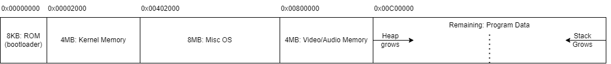

# The Iridium Computer Emulator

Part of a series on my blog: [The System Fire](https://www.thesystemfire.com/).

The Iridium Computer Emulator is a program written in pure C which is designed to emulate the Iridium Computer (of course). This is a custom 16-bit processor the author of this repository has designed and plans to implement using a microcontroller, probably the Raspberry Pi Zero W.

## The Architecture

The architecture uses a custom instruction set, the specification for which can be found [here](https://github.com/DominicThorpe/iridium_assembler). There are 16 registers available, 5 of which are special-purpose, and 10 are general-purpose. 4 of the special-purpose registers are 32 bits instead of 16 so they can store complete memory addresses.

The hardware architectire is 16-bits, but has a 32-bit wide address bus, so can address up to 4GB of memory, with a minimum of 8KB being ROM, 64KB being for video memory, and 32KB being for the kernel, leaving most of the ram available for user programs.

There is also support for a number of I/O devices. We plan to support an SD Card for the hard drive, video and sound output, and a keyboard. There may also be mouse support, but this is not yet decided.

### Memory Map

The diagram below shows how memory is laid out in the system. Because we have an address space of 4GB, we know we can have *up to* 4GB of RAM/ROM, but we don't know how much we will actually have. When we implement a microprocessor version of this system, this amount will be much less than 1GB.

The program counter will always start at 0x0000 0000, and that is where the 1st instruction of the bootloader will be located. The bootloader will first go into the harddrive and locate a file called *"iridium_OS.ird"*, and load the entirety of the contents into RAM, starting at 0x0000 2000, then it will move the program counter to there and start executing the operating system.

## Current Progress

This project is still a WIP with a lot left to go. The roadmap is as follows, and always check the blog to see current progress:
  - Memory
    - [x] Array-based implementation of the registers, including 16- and 32-bit registers  
    - [x] Chained hashmap implementation of RAM
    - [ ] File-based implementation of ROM
    - [ ] File-based implementation of SD hard drive

  - Processing
    - [x] Processing RRR-type ALU instructions (ADD, SUB, SLL, SRL, SRA, NAND, OR)
    - [x] Processing RRR-type memory read/write instructions (LOAD, STORE)
    - [x] Processing RRI-type ALU instructions (ADDI, SUBI)
    - [x] Processing RII-type general instructions (MOVLI, MOVUI)
    - [x] Processing ORR-type ALU instructions (ADDC, SUBC)
    - [ ] Processing ORI-type system instructions (must wait for OS)
    - [ ] Program halting (must wait for OS)

  - Flow-Control
    - [x] Unconditional branching (JUMP, JAL)
    - [x] Comparing values of 2 registers (CMP)
    - [x] Conditional branching (BEQ, BNE, BLT, BGT)

  - Program Loading
    - Can load instructions from a specified file
      - [x] Into RAM
      - [ ] Bootloader
      - [ ] Into hard drive
    - [ ] Can load instructions from ROM
    - [ ] Can load files from hard-drive
